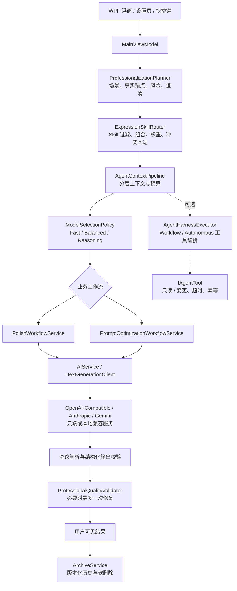

# 话匣子 Agent 应用架构与工程编排

> 面向开发者的架构说明。本文描述当前生产代码中的边界、运行时链路和可扩展编排能力；实验数据与历史审计结论请分别参阅项目报告。

## 1. 项目概述

话匣子（Huaxiazi）是一个本地优先的 Windows WPF Agent 应用，面向中文表达处理与提示词工程。它不训练基础模型，也不提供自营模型服务；应用负责把用户输入、事实约束、表达策略和输出协议编排成一次受控的 LLM 请求，再对结果执行解析、质量校验、有限修复和本地归档。

系统支持两个产品工作流：

| 工作流 | 输入 | Agent 目标 | 输出门禁 |
| --- | --- | --- | --- |
| 表达润色 `Polish` | 口语化、零散或不完整的中文表达 | 保留事实、立场、数字、日期和不确定程度，生成可直接使用的成稿 | `PolishResponseParser` + `ProfessionalQualityValidator` |
| 提示词优化 `PromptOptimize` | 模糊的任务描述 | 提取目标、背景、约束、步骤、输出格式和验收标准，生成可交给模型的提示词 | 结构化解析 + 本地质量门禁 |

“Agent”在本项目中指受约束的任务执行系统，而不是一个可以任意访问机器的聊天机器人。模型只负责在已编排上下文中生成候选结果；安全边界、任务状态、工具权限、重试策略和最终交付由本地工程代码掌控。

## 2. 总体架构



架构可分为四个平面：

1. **交互平面**：WPF 浮窗、设置页、系统托盘和快捷键负责收集意图、呈现状态，不直接拼接高权限提示词。
2. **决策平面**：规划器、Skill 路由器和模型策略把自然语言输入转成可审计的执行计划。
3. **执行平面**：上下文管线、Provider 适配器、业务工作流和可选 Harness 负责一次或多步执行。
4. **治理平面**：安全清洗、质量门禁、预算、幂等、归档和测试为执行平面提供不变量。

## 3. 核心模块

| 模块 | 代码入口 | 责任 | 明确不负责 |
| --- | --- | --- | --- |
| 任务规划 | `ProfessionalizationPlanner`、`SmartContextAnalyzer` | 识别场景、收件人、目的、风险、事实锚点和澄清问题；给出模型档位建议 | 不调用模型、不执行工具 |
| Skill 路由 | `ExpressionSkillRouter`、`AgentSkillPackageService` | 按模式、启用状态、兼容性、标签和用户偏好筛选；最多组合 3 个高置信 Skill | 不执行 Skill 内脚本、Shell、MCP、浏览器或任意文件访问 |
| 上下文编排 | `AgentContextPipeline`、`PromptLayerComposer` | 按固定层级组装 system/developer/facts/skills/memory/knowledge/tools/task，计算预算和省略层 | 不改变事实优先级，不让用户文本替换 system 安全边界 |
| 提示构建 | `PromptBuilderService`、`PolishPromptBuilderService` | 读取内置提示模板、类别增强和低优先级表达指导，输出 Provider 无关的请求上下文 | 不保存 API Key，不决定归档策略 |
| 业务工作流 | `PolishWorkflowService`、`PromptOptimizationWorkflowService` | 管理生成、解析、质量校验、有限修复和结果状态 | 不无限重试，不把未通过门禁的文本当作成功 |
| LLM 适配 | `AIService`、`ITextGenerationClient` | 适配 OpenAI-Compatible、Anthropic Messages、Gemini GenerateContent；限制响应大小、超时和重定向 | 不记录完整请求正文、响应正文或 API Key |
| 工具 Harness | `AgentHarnessExecutor`、`StreamingToolCallAssembler` | 对 Workflow/Autonomous 工具请求执行并发、重试、超时、权限和状态机控制 | 不允许未知工具或无幂等键的变更操作 |
| 结果治理 | `ProfessionalQualityValidator`、`StructuredGenerationWorkflow` | 校验事实/约束/格式，必要时执行有界修复；统一空响应和结构化错误 | 不伪造缺失业务事实 |
| 本地状态 | `ArchiveService`、`WorkspaceDraftService`、`UserMemoryPolicy` | 管理草稿、历史版本、软删除、记忆授权和保留期 | 不上传本地历史，不把敏感记忆注入 Prompt |

## 4. 一次任务如何流转

```text
用户输入
  → 输入规范化与模式选择（Polish / PromptOptimize）
  → SmartContextAnalyzer 提取场景、风险、事实锚点
  → ProfessionalizationPlanner 生成执行计划与澄清问题
  → ExpressionSkillRouter 过滤/组合表达 Skill，并检测冲突
  → PromptBuilderService 或 PolishPromptBuilderService 生成模式上下文
  → AgentContextPipeline 分层、转义、预算裁剪并计算稳定前缀哈希
  → ModelSelectionPolicy 选择最低满足约束的模型档位
  → AIService 通过 Provider 协议发送一次生成请求
  → 协议解析、结构化输出校验和业务质量门禁
  → 失败时最多一次定向修复；仍失败则返回可解释阻断状态
  → 成功结果呈现，并按用户设置写入版本化本地归档
 ```

### 4.1 澄清与计划状态

规划器不会为了填满字段而向用户连续追问。只有输入过短、缺少关键对象或无法安全推断时，计划才标记 `NeedsClarification` 并返回有限问题；普通缺失信息采用保守策略，不编造业务事实。计划中保留 `FidelityAnchors`、`RiskLevel`、`SelectedSkillIds`、`SkillWeights` 和 `RecommendedModelTier`，因此一次运行可以被测试、回放和解释。

### 4.2 生成与质量状态

业务工作流至少区分 `Final`、`Invalid`、空响应、质量未通过和阻断等状态。润色流程在事实安全但表达质量不足时只允许一次修复；修复结果仍不安全时不会强行展示。提示词优化流程对空响应单独处理，避免把空字符串误判成已完成。

## 5. 上下文传递与状态管理

### 5.1 固定层级

`AgentContextPipeline` 使用稳定的协议顺序：

```text
system → developer → facts → skills → user_memory → personalization → knowledge → tools → task
```

- `system`：产品安全边界和基础行为，始终由应用提供。
- `developer`：类别、深度和经过过滤的用户表达指导，不能覆盖 system。
- `facts`：必须保留的姓名、数字、日期、否定关系和不确定程度。
- `skills`：已启用且与当前模式匹配的表达策略；最多组合三个候选，冲突时回退主 Skill。
- `user_memory` / `personalization`：只影响语气、格式和偏好；Sensitive 记忆永不进入 Prompt。
- `knowledge`：reference-only 证据，带来源与评分，不能获得工具权限。
- `tools`：经过安全投影的工具描述，不暴露原始不可信描述。
- `task`：本次用户请求，保持独立边界，不从系统上下文臆造事实。

每层可以独立计算优先级、字符预算、稳定性和是否被省略。必要层溢出时返回 `RequiredOverflow`，而不是静默截断；稳定前缀哈希写入执行 trace，便于回放与缓存分析。

### 5.2 本地状态

运行时状态分为三类：

| 状态 | 生命周期 | 处理方式 |
| --- | --- | --- |
| 本次任务状态 | 单次生成请求 | 在 ViewModel/Workflow 中传递，取消请求后停止后续处理 |
| 工作区状态 | 当前用户会话 | 草稿可保存/恢复；无痕模式不恢复或写入草稿 |
| 持久化业务状态 | 用户明确启用后 | SQLite 保存历史版本、软删除和可选原文；由保留期和用户清理操作管理 |

API Key 不进入上下文层或日志，使用 Windows DPAPI 按当前用户加密保存。模型请求只发送用户主动提交的正文与明确填写的背景。

## 6. 工具调用与复杂工作流编排

工具能力通过 `IAgentTool` 注册，执行器不直接相信模型输出，而是对每个请求重新校验：

1. 工具名称必须已注册且唯一；声明的 `ReadOnly/Mutating` 安全等级必须与实现一致。
2. 每次调用有 100–120,000 ms 的独立超时；未知工具、等级不匹配和非法超时立即失败。
3. Workflow 模式按计划串行执行；Autonomous 模式只并行只读工具，变更工具保持串行。
4. 只读调用可进行有限指数退避重试；变更调用不自动重放。
5. 变更调用必须携带幂等键；成功结果按 TTL 缓存，重复请求不重复触发副作用。
6. 流式工具参数必须经历 `ToolStart → ArgumentsDelta → ToolEnd`，在闭合并通过 JSON 校验前不得执行。
7. 工具输出再次经过 `PromptInjectionSanitizer`，trace 只记录工具、步骤、尝试次数、错误码和停止原因，不记录思维链。

当前产品的两个中文表达工作流主要使用受控的 LLM 生成调用；`AgentHarnessExecutor` 是可复用的工具编排边界，适合未来接入本地文件索引、结构化数据或其他明确授权的工具，但不会自动赋予 Skill 或模型系统权限。

## 7. 安全与质量门禁

- **输入与 Skill**：Unicode 归一化、零宽字符清理、提示注入检测；外部 Skill 仅投影为低优先级表达策略。
- **端点与凭据**：Provider Endpoint 白名单/协议校验；HTTP 禁止跨主机自动重定向；错误信息不回显完整服务端正文。
- **输出**：优先使用 Provider 原生 JSON Schema，否则使用本地解析器和 `StructuredOutputValidator`；最多 2–3 次受限尝试。
- **事实保真**：质量验证器检查事实锚点、承诺强度、日期/金额/数量和不确定性，不满足时阻断或修复。
- **数据生命周期**：本地历史默认明文存储，用户可关闭保留、导出、软删除或永久清理；无痕模式不写历史。
- **可观测性**：trace 记录足以复盘编排决策的元数据，不记录 API Key、完整 Prompt、完整响应或隐藏推理过程。

## 8. Provider 与部署边界

`AIService` 通过 `ITextGenerationClient` 隔离业务工作流与 Provider 协议。当前支持 OpenAI-Compatible、Anthropic Messages、Gemini GenerateContent，并兼容本地 Ollama/LM Studio 等 OpenAI-compatible 服务。模型配置、采样参数、超时和协议属于 Provider Profile；任务规划只提出 `Fast/Balanced/Reasoning` 档位建议，不绑定某一家模型。

应用是单机、本地优先架构：没有账号系统、服务端数据库、云端同步或自营 AI 后端。用户可选择云端模型服务，但网络边界只在生成请求发生时打开。实验数据集、DatasetBuilder、训练日志和测试程序集不属于生产运行时，也不应进入发布包。

## 9. 典型使用场景

| 场景 | 编排价值 |
| --- | --- |
| 把口语消息整理为正式通知 | 规划器提取收件人和事实锚点，Skill 调整语气，质量门禁防止强化不确定承诺 |
| 将模糊需求改写为工程提示词 | PromptOptimize 提取目标、输入、约束、流程、输出协议和验收标准 |
| 多个表达风格同时启用 | 路由器按相关性组合最多三个 Skill；发现“简洁/详细”等冲突时回退主 Skill |
| 模型返回空内容或格式错误 | Provider 适配器归一化错误，结构化工作流只做有界修复，不进入无限重试 |
| 未来接入受控工具 | Harness 通过安全等级、超时、幂等和总调用预算约束副作用 |

## 10. 技术亮点与工程价值

1. **把 Prompt 变成可编排上下文**：层级、优先级、预算、转义和稳定前缀均由代码管理，不依赖一段不可审计的超长字符串。
2. **把 Agent 行为变成有限状态机**：工具、流式参数、质量修复和错误处理都有明确终态，避免无限循环和隐式重试。
3. **把模型不确定性隔离在门禁内**：模型可以生成候选，但事实、权限、格式和副作用由本地治理代码最终裁决。
4. **把扩展点设计成可替换边界**：Provider、Embedding、Skill、幂等存储和工具实现均通过接口/策略隔离，未来扩展不必重写业务工作流。
5. **把复杂度转成可测试证据**：计划、路由、上下文省略、工具 trace、质量问题和模型档位均可被专项测试与回放。

## 11. 当前边界与后续方向

当前实现已具备生产级 Harness 的关键控制点，但不应宣称所有 Provider、模型和工具场景都已达到同一成熟度。真实持久化向量数据库、多模态知识抽取、跨 Provider 流式工具协议和大规模模型消融仍属于后续演进方向。任何新增工具或自动化能力都必须先补齐权限模型、数据来源、幂等策略、回放 trace 和回归测试。

相关文档：

- [表达模块边界与外部 Skill 架构](FUNCTIONAL_BOUNDARIES_AND_SKILLS.md)
- [Agent 架构升级基线](AGENT_ARCHITECTURE_UPGRADE.md)
- [智能编排与质量保障](智能编排与质量保障.md)
- [隐私与数据](隐私与数据.md)
- [发布检查清单](发布检查清单.md)
